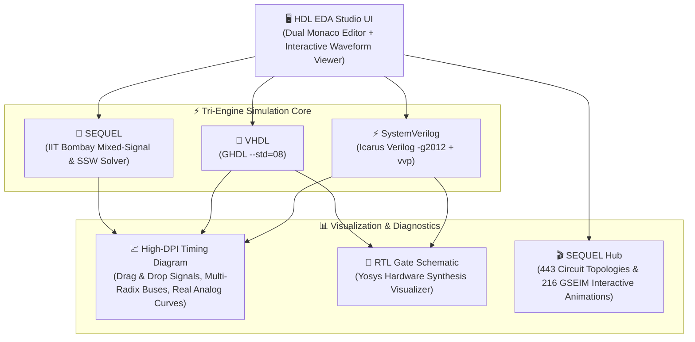

<div align="center">

# ⚡ HDL EDA Studio (`Verilog_Tool`)

**A Unified Desktop Workstation (Tauri v2 + Rust) & Universal Web IDE for SystemVerilog, VHDL & SEQUEL Mixed-Signal Circuits**

*Instant Sub-Millisecond Simulation • Ultra-Lightweight (~15MB Desktop Binary) • Dual Monaco Editors • Interactive High-DPI Waveform Viewer • Integrated SEQUEL Engine (IIT Bombay) • Power Electronics DSP Library • 443 Circuit Topologies • 216 Interactive GSEIM Animations • Drag & Drop Signal Reordering • Universal Web & Desktop Ready*

<br />

[](LICENSE)
[](https://tauri.app/)
[](https://www.rust-lang.org/)
[](https://en.wikipedia.org/wiki/SystemVerilog)
[](https://en.wikipedia.org/wiki/VHDL)
[](https://www.ee.iitb.ac.in/~sequel/)
[](http://iverilog.icarus.com/)
[](https://ghdl.github.io/ghdl/)
[](https://punitr2007.github.io/Verilog_Tool/)
[](https://vercel.com/)

<br />

</div>

---

## 📖 Overview

**HDL EDA Studio** is a full-fledged, standalone local desktop EDA workstation and universal web IDE designed for digital logic designers, FPGA engineers, power electronics developers, and electrical engineering students. 

Benchmarked against tools like **LTspice**, ModelSim, EDA Playground, and GTKWave, it combines **digital hardware description languages (SystemVerilog & VHDL)** with the **IIT Bombay SEQUEL mixed-signal & power electronics simulation engine** into a single cohesive interface.



---

## ✨ Key Features

### 1. ⚡ Tri-Engine Real-Time Simulation
* **SystemVerilog Engine:** Native [Icarus Verilog](http://iverilog.icarus.com/) (`iverilog -g2012`) + `vvp` execution with automatic `$dumpfile` safeguards.
* **VHDL Engine:** Native [GHDL](https://ghdl.github.io/ghdl/) (`ghdl -a --std=08`, `ghdl -e`, `ghdl -r`) with IEEE standard library bindings.
* **SEQUEL Mixed-Signal Engine:** Native 64-bit [SEQUEL](https://www.ee.iitb.ac.in/~sequel/) simulation kernel from IIT Bombay with fast **Steady-State Waveform (SSW)** solver for power converters.
* **Universal Web Mode:** Automatic client-side simulation fallback when hosted on static platforms like GitHub Pages or Vercel.

### 2. 📝 Dual Monaco Editor (VS Code Engine)
* **Side-by-Side Split View:** Simultaneously edit your hardware design (`design.sv` / `design.vhd` / `circuit.in`) alongside testbench stimulus (`testbench.sv` / `testbench.vhd` / `solve.in`).
* **`eda-dark` Theme:** Tailored dark theme with clear contrast, font ligatures, line highlights, and syntax coloring.
* **Global Hotkeys:** <kbd>Ctrl</kbd> + <kbd>Enter</kbd> to simulate, <kbd>Ctrl</kbd> + <kbd>S</kbd> to save, <kbd>Ctrl</kbd> + <kbd>O</kbd> to load folder, and <kbd>Ctrl</kbd> + <kbd>H</kbd> to open the SEQUEL Hub.

### 3. 📈 Interactive High-DPI Waveform Viewer
* **Drag-and-Drop Signal Reordering:** Drag any signal handle (`≡`) up or down to reorder nets dynamically; the timing diagram automatically updates in sync.
* **Digital Pulse & Bus Diamond Rendering:** 1-bit square pulses and multi-bit buses with decoded hex/dec/bin data labels.
* **Analog Waveform Bridge:** Visualizes continuous voltages and currents from SEQUEL circuit simulations.
* **Time Cursor & Scrubbing:** Scrub the canvas to inspect values at exact timestamps.
* **Configurable Radix:** Switch between **HEX**, **BIN**, **DEC**, and **ASCII**.
* **Snapshot Export:** Export high-resolution PNG images of waveforms for reports.

### 4. 🔌 Power Electronics DSP & Mixed-Signal Template Library
Includes ready-to-run HDL and circuit templates:
* **Space Vector PWM (SVPWM):** 3-Phase sector synthesizer and carrier modulation for inverters.
* **Dead-Time & Complementary PWM Generator:** High-side/low-side gate driver with shoot-through interlock protection.
* **Delta-Sigma 1-bit DAC / Modulator:** Error-feedback noise-shaping digital-to-analog converter.
* **DC-DC Buck Converter (SSW):** Periodic steady state solved in 3 cycles using SEQUEL.
* **IC 555 Timer Astable Multivibrator:** Mixed analog/digital multivibrator oscillation.
* **RC Step & RLC Resonance:** Transient and AC step responses.

### 5. 🎬 SEQUEL Hub: 443 Circuits & 216 GSEIM Animations
Press <kbd>Ctrl</kbd> + <kbd>H</kbd> (or click **`🔌 SEQUEL Hub`**) to access:
* **443 Pre-Built Topologies:** Categorized into DC-DC, Inverters, Rectifiers, Resonant Converters, Motor Drives, Solar MPPT, and Active Filters with one-click *"⚡ Load in Editor"* and direct links to theory PDFs.
* **216 Interactive GSEIM Animations:** Embedded HTML simulations for Space Vector trajectories, PWM switching, PLL synchronization, and 3-phase waveforms.
* **IIT Bombay Lecture Slides:** Embedded manuals and slide decks on numerical simulation techniques.

---

## 🚀 Quick Start

### Option 1: Run Locally via Node.js
```bash
# Clone the repository
git clone git@github.com:punitr2007/Verilog_Tool.git
cd Verilog_Tool

# Install dependencies
npm install

# Launch the EDA Studio
npm start
```
Open **`http://localhost:4500`** in your browser.

---

### Option 2: Run as Native Desktop App (Tauri v2 + Rust)
```bash
# Install Tauri CLI & run desktop dev mode
npm run desktop

# Build standalone release binary (~15MB)
npm run desktop:build
```

---

## 🌐 Universal Web Deployment

### Deploy to GitHub Pages (Automated via GitHub Actions)
This repository includes a pre-configured GitHub Actions workflow in [`.github/workflows/deploy.yml`](.github/workflows/deploy.yml).

1. Push code to the `main` branch:
   ```bash
   git push origin main
   ```
2. In your GitHub repository:
   - Go to **Settings** ➔ **Pages**.
   - Under **Build and deployment** ➔ **Source**, select **GitHub Actions**.
3. Your web IDE will be live at:
   `https://punitr2007.github.io/Verilog_Tool/`

---

### Deploy to Vercel
This repository includes [`vercel.json`](vercel.json) for instant zero-configuration deployment:

1. Import the repository `punitr2007/Verilog_Tool` on [Vercel](https://vercel.com/new).
2. Framework Preset: **Other**.
3. Output Directory: **`public`**.
4. Click **Deploy**.

---

## 📂 Project Structure

```text
Verilog_Tool/
├── public/                                   # Universal Static Frontend
│   ├── index.html                            # Main IDE interface & SEQUEL Hub modal
│   ├── app.js                                # Application logic & Monaco orchestrator
│   ├── waveform.js                           # High-performance waveform & timing canvas
│   ├── schematic.js                          # RTL schematic visualizer
│   ├── styles.css                            # Modern CollectUI / dark IDE design system
│   └── sequel_hub/                           # 443 circuit index, 216 animations & PDF docs
│
├── sequel_engine/                            # Embedded 64-bit Linux SEQUEL simulation kernel
│   ├── exec/                                 # sqlcppmain_fixed_static & sqlcppprep_fixed_static
│   ├── .sqlaux/                              # Element description lists (.lst)
│   └── .sqllib/                              # Model libraries (.lib)
│
├── src-tauri/                                # Tauri v2 Native Desktop Rust Backend
│   ├── src/lib.rs                            # Native IPC simulation & file management
│   ├── src/main.rs                           # Desktop entry point
│   └── tauri.conf.json                       # Tauri desktop application configuration
│
├── workspace/                                # Built-in project workspaces (.sv, .vhd, .in)
│   ├── 01_basic_gates/                       # SystemVerilog basic logic gates
│   ├── 02_counter_4bit/                      # 4-bit synchronous counter
│   ├── 03_fsm_detector/                      # Sequence detector FSM
│   ├── 05_vhdl_logic_gates/                  # VHDL-2008 logic gates
│   ├── 06_sequel_buck_ssw/                   # SEQUEL DC-DC Buck Converter (SSW)
│   ├── 07_sv_svpwm/                          # SystemVerilog Space Vector PWM
│   └── 08_sv_deadtime_pwm/                   # SystemVerilog Dead-Time PWM Gate Driver
│
├── server.js                                 # Express simulation server & API bridge
├── vercel.json                               # Vercel deployment configuration
├── .github/workflows/deploy.yml              # GitHub Actions deploy workflow
└── README.md                                 # This documentation file
```

---

## 📜 License

Distributed under the **MIT License**. See [`LICENSE`](LICENSE) for details.
